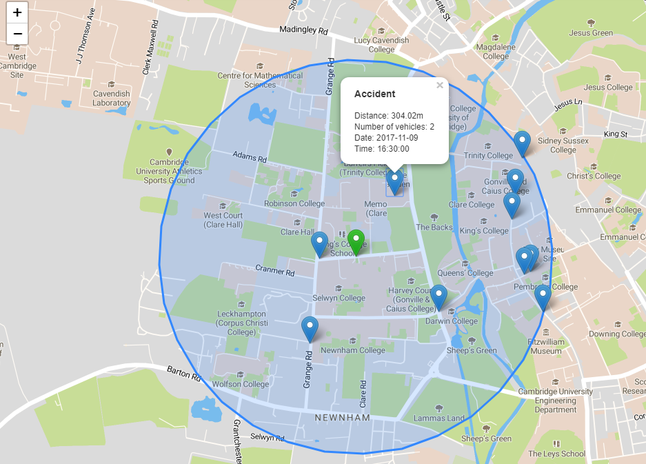

# Prehľad

Aplikácia zobrazuje dopravné nehody na celom území Anglicka. Aplikácia umožňuje:

- vyhľadávanie najbližších nehôd v okolí zvoleného bodu na mape
- zobrazovanie najnebezpečnejších úsekov v okolí zvolenej školy
- zobrazenie farebnej mapy územných celkov podľa výskytu nehôd na km2
- zobrazenie dopravných nehód na zvolenom cestnom úseku

Ukážka aplikácie:


Aplikácia je rozdelená na dve časti, [klientska časť](#frontend), ktorá využíva rámec Angular a pre zobrazovanie mapy knižnicu leaflet.js, a časť server, ktorá využíva technológiu node.js a webový rámec express.js. Okrem toho, časť server obsahuje aj uložisko dát v podobe PostgreSQL databázy a rozširenia PostGIS. Spomínané časti medzi sebou komunikujú prostredníctvom [REST API](#api).

# Frontend

Klientská časť aplikácie využíva webový rámec Angular, kde je zobrazovaná mapa impementovaná v podobe komponentu (map.component). Pre lepšiu integráciu knižnice leaflet bol použitý balík [ngx-leaflet](https://github.com/Asymmetrik/ngx-leaflet).

Knižnica leaflet v našom prípade zobrazuje mapu prostredníctvom MapBox. Štýl mapy bol upravený tak, aby boli zobrazované elementy dobre viditeľné. Bolo zmenené pozadie budov aj samotnej mapy a odstránené cesty pre chodcov, ktoré pre nás neboli relevantné.

Samotná logika mapy je v súbore `map.component.ts`, HTML kód v súbore `map.component.html` a potrebné štýly v `map.component.scss`. Rozloženie a menu aplikácie je v komponente `main.component`.

# Backend

Časť server je implementována pomocou rámca Express.js. Táto časť vystavuje endpoint-y, ktoré z databázy vráti dáta v podobe GeoJson Feature. Interakcia medzi node.js a PostgreSQL je zapezpečená prostredníctvom [node-postgres](https://node-postgres.com/).

## Data

Dáta o jednotlivých cestách a školách boli stiahnuté z Open Street Maps. Celkovo tieto dáta obsahujú oblasť celého Anglicka (756MB vo formate pbf). Dáta o dopravných nehodách v Spojenom kráľovstve boli stiahnuté z [data.gov.uk](https://data.gov.uk/dataset/cb7ae6f0-4be6-4935-9277-47e5ce24a11f/road-safety-data). Tieto dáta obsahujú hlásené nehody na cestách za rok 2017. Celkovo ide o približne 130 000 záznamov. Dáta obsahujú informácie o čase a dátume nehody, informácie o počte havarovaných aut a súrandice nehody. Na základe súradníc bol v databáze vytvorený stĺpec geom, ktorý predstavuje bod v geometrii. Pri všetkých dátach sme pracovali s projekciou 4326.

## Api

**Vyhľadá najbližšie nehody k zvolenému bodu v zvolenej vzdialenosti**

`GET /api/accidents-in-range?distance=100&lng=-0.11916518211364747&lat=51.51125983549227`

**Vráti zoznam škôl v danom meste**

`GET /api/schools?city=Cambridge`

**Vráti geometriu danej školy**

`GET /api/school?schoolId=6438526`

**Vráti cesty v okolí zvolenej školy spolu s počtom nehôd na týchto cestách**

`GET /api/accidents-school?schoolId=6438526`

**Vráti územné oblasti danej kategórie spolu s počtom nehôd v nich a ich rozlohou**

`GET /api/accidents-area?adminLevel=5`

**Vráti všetky body (nehody) na cestnom úseku, ktorý je najbližšie k zvolenému bodu**

`GET /api/accidents-on-road?lng=0.1078784465789795&lat=52.20272143657673`

### Response

Odpovede servera predstavujú pole `geoJson` objektov typu `Feature`, ktorý obsahuje `geoJson` objekt pod kľúčom `geometry` a pod kľúčom `properties` ďalšie volitelné údaje.

Príklad formátu dát:

```JSON
{
  geometry: {type: "Point", coordinates: [0.105035, 52.19941]}
  properties: {
    date: "2017-01-16T23:00:00.000Z"
    distance: 416.60772252
    numberOfVehicle: 2
    time: "08:50:00"
  }
  type: "Feature"
}
```

# Scenáre

## 1. Scenár

### Hľadanie nehôd v blízkosti zvoleného bodu

Kliknutím na mapu používateľ zvolí bod a okruh (v metroch), v ktorom chce zobraziť dopravné nehody. Po vyhľadaní, sa zobrazi okruh vyhľadávania spolu s bodmi, ktoré predstavujú dopravné nehody. Kliknutím na bod sa zobrazia ďalšie informácie o dopravnej nehode, ako napríklad vzdialenosť od zvoleného bodu, dátum a čas nehody.



#### SQL

```SQL
WITH center_point as (SELECT st_setsrid(st_point($1, $2), 4326)::geography as geom)
    SELECT st_asgeojson(a.geom), st_distance(a.geom, point.geom) as distance, a.accident_date, a.acccident_time as accident_time, number_of_vehicle
      FROM accidents07 a
      CROSS JOIN center_point as point
        WHERE ST_DWithin(a.geom::geography, point.geom, $3)
    UNION ALL
      SELECT st_asgeojson(st_buffer(geom, $3)), null, null, null, null
        FROM center_point
```


## 2. Scenár

Používateľ zvolí mesto z dropdown zoznamu, následne zvolí školu, pre ktorú chce zobraziť nebezpečné cesty v okolí (300m). Kliknutím na tlačidlo Show sa na mape farebne vyznačia všetky cestné úseky v okruhu školy. Najnehodovejší úsek je zobrazený červenou farbou, úsek na ktorom bolo najmenej nehôd je zobrazený žltou farbou.


#### SQL

```SQL
WITH
  school as (SELECT way FROM planet_osm_polygon WHERE id=$1),
  accidents as (SELECT * FROM accidents07 a JOIN school s on st_dwithin   (s.way::geography , a.geom::geography, 300)),
    lines as (SELECT ST_Intersection(tab1.range, tab2.way) as intersection FROM
        (SELECT st_buffer(way::geography, 300) as range FROM school) tab1
          JOIN
          (SELECT way, name from planet_osm_line WHERE highway is not NULL AND highway!='footway') tab2
          ON st_intersects(tab1.range, tab2.way)),
  accidents_on_roads as (SELECT * FROM accidents a RIGHT JOIN lines r ON st_dwithin(r.intersection::geography ,a.geom::geography, 5))

  SELECT st_asgeojson(intersection) as way, count(accident_index) from accidents_on_roads GROUP BY intersection
```


## 3. Scenár

Aplikácia umožňuje používateľovi zobraziť mapu nehodovosti v rámci územných celkov. Používateľ, može zvoliť, či chce zobraziť mapu pre region, kraje alebo okresy Anglicka. Oblasť je sfarbená podľa počtu nehôd na km2 v oblasti. Po kliknutí na danú oblasť sa zobrazí počet nehôd, rozloha a počet nehôd na km2 v danej oblasti.


#### SQL

#### Materializované view

V tomto prípade išlo o náročný dopyt, ktorý trval viac ako minútu a pridanie indexov nedopomohlo k tomu, aby bol dopyt vrátený v uspokojivom čase, preto sme sa rozhodli vytvoriť materializované view, ktoré má už predpočítaný počet nehôd pre každý územný celok.

```SQL
CREATE MATERIALIZED VIEW accidents_in_admin_level AS
 WITH accident_counts AS (
         SELECT d.id,
            count(*) AS count
           FROM accidents07 a
             CROSS JOIN (
               SELECT id, name, way
                  FROM planet_osm_polygon
                  WHERE planet_osm_polygon.boundary = 'administrative' AND admin_level IN ('5', '6','8')) d
          WHERE st_contains(d.way, a.geom)
          GROUP BY d.id
        )
 SELECT p.name, p.id, p.admin_level, ac.count, st_area(p.way::geography) AS area, p.way
   FROM accident_counts ac
   JOIN planet_osm_polygon p ON p.id = ac.id
```

```SQL
SELECT name, count, st_asgeojson(way) as polygon, area
    FROM accidents_in_admin_level 
    WHERE admin_level=$1
```

## 4. Scenár

Kliknutím na cestu v mape aplikácia vyhľadá najbližší cestný úsek a všetky nehody na ňom.


#### SQL

```SQL
WITH road as (
      SELECT way FROM
          (SELECT st_setsrid(st_makepoint($1, $2), 4326) as geom) point
          JOIN
          (SELECT * FROM planet_osm_line WHERE highway is not NULL AND highway!='footway') line
          ON st_dwithin(point.geom::geography ,line.way::geography, 5)
        LIMIT 1
    ),
    road_accidents as (
      SELECT *
      FROM accidents07 a JOIN road r
      ON
      st_dwithin(r.way::geography ,a.geom::geography, 10)
    )

    SELECT st_asgeojson(geom) as geo, accident_date, acccident_time as accident_time, number_of_vehicle FROM road_accidents
    UNION ALL
    SELECT st_asgeojson(way) as geo, NULL, NULL, NULL FROM road
```

#### Indexy

Okrem geo indexov, ktoré boli automaticky vytvorené pri importovaní dát do databázy prostredníctvom nástroja osm2pgsql, sme vytvorili nasledujúce indexy:

```SQL
CREATE INDEX accidents_07_geom_index ON accidents07 USING gist(geom)
CREATE INDEX accidents07_geom_geography_index ON accidents07 USING gist (geography(geom))
CREATE INDEX planet_osm_geography_index ON planet_osm_line USING gis (geography(way))
CREATE INDEX highway_index ON planet_osm_line (highway)
CREATE INDEX planet_osm_polygon_geography_index ON planet_osm_polygon USING gist (geography(way))
CREATE INDEX planet_osm_polygon_id_index ON planet_osm_polygon (osm_id)
CREATE INDEX planet_osm_polygon_admin_level_index ON planet_osm_polygon (admin_level)
CREATE INDEX accidents_view_admin_level_index ON accidents_in_admin_level (admin_level)
```